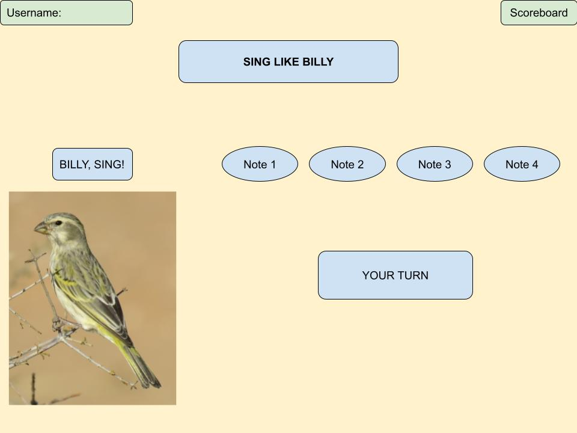

# Sing Like Billy

## Description deliverable

### Elevator pitch

Have you ever heard a beautiful bird song and wanted to mimic it? Billy, a yellow canary, is eager to teach you his songs. Your challenge is to remember the song and repeat back by touching/clicking on the Note buttons. In this fun little game, your musical ears and memory will be put to the test! You can see who is trying to mimic Billy in real time and see how many songs you can mimic Billy. Are you ready? Let’s Sing Like Billy!

### Design

### Key features

- Secure login over HTTPS
- Ability to use keyboard/touch screen to interact and play sounds
- Display of user playing in real time
- Ability to rank users according to their scores
- Display of a scoreboard

### Technologies

I am going to use the required technologies in the following ways.

- **HTML** - Use of correct HTML structure for the game. Four HTML pages. One for login, one for playing, one for scoreboard, and one for the about page.
- **CSS** - Animation of the bird. Game styling that looks good on different screen sizes. 
- **JavaScript** - Login input, sound display, display of other users and scores.
- **Service** - Backend service with endpoints for:
  - login
  - retrieving scores
- **DB** - Store users and scores in database.
- **Authentication** - Register and login users. Credentials securely stored in database.
- **WebSocket** - After each user played, their best score is displayed on the scoreboard.

## HTML Deliverable
For this deliverable I added the application structure.
- **HTML pages** - Fours HTML pages, one for login, one for play, one for scoreboard, one for about.
- **Links** - Each page has links to the other pages. The About page has a link to an external source.
- **Text** - The Bird of the Day section in the About page pulls text and sound from a source to display.
- **Images** - An SVG image of a bird in the Login page. (There's a video but it's not in the rubric)
- **Login** - Input box and submit button for login
- **Database** - The Scoreboard page shows data pulled from the database.
- **WebSocket** - The Play page has a live section of who's doing what (scoring, entering, or exiting the game)

## CSS Deliverable
For this deliverable, I made the application look cute.
- **Header, footer, and main content body** - They're there.
- **Navigation elements** - I added brand logo, dropped the underline, changed the font, added dropdown toggle for mobile view.
- **Responsive to window resizing** - My app looks good on all window sizes and devices. Menu turns to a toggle and the video got dropped in mobile view.
- **Application elements** - Colors go well together, whitespace is appropriate. There're video and picture. Flex ratio is good.
- **Application text content** - Consistent fonts. 
- **Application images** - I added image to the play page, and a logo for the brand.
